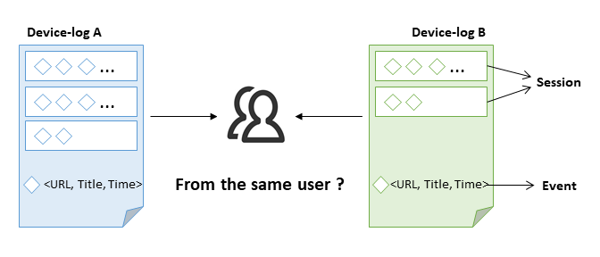

# Cross Device User Linking
This work is exteneded from the 1st place solution in CIKM Cup 2016 by the same author.
The approach is described in the following short paper:
[Cross-Device User Linking: URL, Session, Visisting Time, and Device-log Embedding (SIGIR 2017)](https://www.researchgate.net/publication/318763883_Cross-Device_User_Linking_URL_Session_Visiting_Time_and_Device-log_Embedding)

## Problem
The task is to identify all pairs of device-logs that belong to same users given their browsing logs on different devices. Figure 1 illustrates the task at hand. Each device-log is a list of events in the format of 3-tuple <URL,title,timestamp>.



## Prerequisite
The following data files are required and can be downloaded from https://drive.google.com/drive/folders/0B7XZSACQf0KdNXVIUXEyVGlBZnc:
```
./data/original/facts.json
./data/original/golden_train.csv
./data/original/golden_valid.csv
./data/original/golden_valid2.csv # will be used as testing partition
./data/original/titles.csv
./data/original/urls.csv 
```

## Usage
```
mkdir emb
mkdir candidates
mkdir tmp
mkdir results

python preprocess.py
python candidate_generation.py -nthread 40
python train_device_log_emb.py -nthread 40
python xgb.py -nthread 40
python evaluate.py
```

## Reference
Please cite the following paper if you find the codes useful:
```
@inproceedings{minh2017gbul,
  author    = {Minh C. Phan and Aixin Sun and Yi Tay},
  title     = {Cross-Device User Linking: URL, Session, Visiting Time, and Device-log Embedding},
  booktitle = {Proceedings of the 40th International {ACM} {SIGIR} Conference on Research and Development in Information Retrieval, Shinjuku, Tokyo, Japan},
  pages     = {933--936},
  year      = {2017},
  doi       = {10.1145/3077136.3080682},
}
```

(by Minh C. Phan phan0050@e.ntu.edu.sg)
